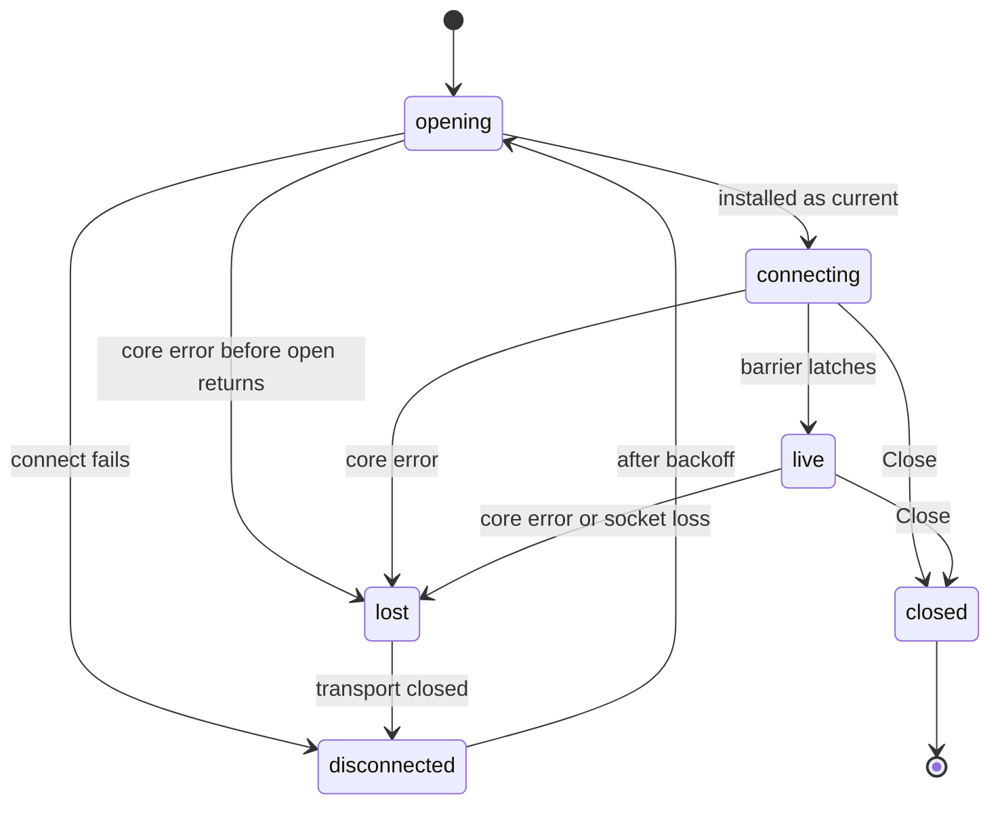

# Backend

`internal/pipewire` is Patchbay's only contact with PipeWire. It owns one connection, observes the graph into immutable snapshots, and reports discrete changes as events. The ui (when it exists) reads a snapshot once per frame and never holds a native handle.

## Contract

```go
type Conn interface {
    Snapshot() *Snapshot     // immutable; pointer identity changes only when content does
    Events() <-chan Event    // buffered and lossy; hints only
    CreateLink(session uint64, outPort, inPort Serial) RequestID
    DestroyLink(session uint64, link Serial) RequestID
    SetForceQuantum(frames int) RequestID   // 0 releases
    ResetMetricsBaseline()
    Close()
}
```

`CreateLink` and `DestroyLink` take the connection session of the snapshot the caller acted on, because serials name objects only within one session. Their handling, confirmation rules, and provenance are in `patching.md`. `SetForceQuantum` is described in `quantum.md`, and `ResetMetricsBaseline` and `Snapshot.Metrics` in `monitoring.md`.

`pipewire.Connect()` never fails. A daemon that cannot be reached is published as `disconnected` with the error text and retried.

A `Snapshot` carries a generation counter, a session number, the connection state (and the last disconnect reason), the request table (`Requests`), and maps keyed by `Serial` for nodes, ports, links, devices, and clients, plus the decoded `settings` metadata and the `default` metadata entries. Every object carries its serial, its protocol id (for requests only), its full property map, and the typed fields the model reads:

| type | typed fields |
| --- | --- |
| `Node` | `Name` (`node.name`), `AppName` (`application.name`), `Description` (`node.description`), `Nick` (`node.nick`), `MediaClass`, `HasDevice`, `DeviceSerial`, `State`, `Error` |
| `Port` | `NodeSerial`, `NodeID`, `Direction`, `Media`, `Monitor`, `Name` (`port.name`), `Alias` (`port.alias`), `AliasPrefix` |
| `Link` | `OutPort`, `InPort`, `OutNode`, `InNode` (all serials), `State`, `Error`, `CreatedHere` |
| `Settings` | `Rate`, `Quantum`, `MinQuantum`, `MaxQuantum`, `ForceQuantum`, `ForceSeen` (`clock.force-quantum` parsed as a whole number of zero or more), `ForceRate`, `Present` |

`Port.Media` comes from `format.dsp` (`midi` or `UMP` is MIDI, `audio` is audio); a port with no dsp format whose node's `media.class` contains `Video` is video; anything else is unknown. `Port.AliasPrefix` is the text of `port.alias` before its first colon, empty when there is none. `Node.HasDevice` says the node carries a `device.id`; `Node.DeviceSerial` is the serial of the device it names, zero when it names none or the device was not observed. Node and link states are the bound-info states as PipeWire names them. The model reads these typed fields and never the property maps; the maps are carried for display. Missing properties are empty strings; nothing panics on a malformed or absent property, and an object without a usable `object.serial` is not tracked at all.

Events are `ObjectAppeared` and `ObjectVanished` (kind and serial), `LinkStateChanged` (including a link's first state), `ConnStateChanged`, and `RequestResolved`. An event is sent only after the snapshot containing its subject is published.

The event channel is lossy by design. If the consumer falls more than 4096 events behind, further events are dropped with a log line, and a consumer that reads only once per frame can see several state changes collapse into one snapshot. Events are hints for reacting promptly. Anything that must be correct is derived from the snapshot.

## Identity

Everything live is keyed by `object.serial`. Protocol ids recycle within seconds (REAPER came back with the same node and client ids after a restart on both studio machines), so an id is never used to recognize an object.

References between objects are resolved to serials when the referring object is announced, and only then: a port's owner from its `node.id`, a link's endpoints from its `link.output.*` and `link.input.*` ids, a node's device from its `device.id`.

A metadata entry's subject id resolves to `MetadataEntry.SubjectSerial` when the entry arrives. An entry delivered during initial enumeration (its metadata object can be announced before the node it names) resolves once, when the barrier latches against the complete enumerated graph. When the subject object is removed, its entries unresolve (serial zero) and stay that way, so a node that later takes the id never inherits them. Subject 0 is global and has no serial. Unresolved subjects are not counted in `Unresolved`. A reference whose target is not observed at that moment stays unresolved (serial 0) for the object's lifetime, with a log line, because an id that misses now may later be held by a different object. There is no late resolution. The registry announces objects in registration order, so a target always precedes its references in practice. The snapshot's `Unresolved` count (ports with no owner, links with a missing endpoint, nodes with a `device.id` whose device was not observed) makes any miss visible; `patchbay dump` prints it beside the connection state.

Serials come from a per-daemon counter and repeat after a daemon restart; see Connection lifecycle.

## Observation

The backend runs one `pw_thread_loop` per connection. Every registry global of type Node, Port, Link, Device, or Client is bound, as is the Metadata object named `settings` and the one named `default`; other metadata is ignored. The Profiler global is bound once, for monitoring.

The profiler interface's protocol support is not among the modules a client context loads by default (metadata's is), so binding it needs `libpipewire-module-profiler` loaded into the client's own context. That is what pw-top does. The backend loads it when it creates each connection's context. If it cannot be loaded, monitoring is unavailable and the connection is otherwise unaffected. Bound info replaces the registry-time properties, so node and link states are live.

Callbacks do not build snapshots. The cgo layer translates each callback into an `Input` value (`GlobalAdded`, `GlobalRemoved`, `NodeInfo`, `PortInfo`, `LinkInfo`, `ObjectInfo`, `MetadataProperty`, `ProxyError`, `SyncDone`) and hands it to the `Graph`, then signals a loop event. When the loop finishes the current dispatch, the event folds everything applied since the last fold into one new snapshot and publishes it with an atomic pointer swap. A burst of callbacks becomes one snapshot.

## Connection lifecycle

States are `connecting`, `live`, and `disconnected`.

A connection stays `connecting` until initial observation is complete. That barrier is two core sync round trips plus first info. The first sync, issued after the registry listener is attached, ends enumeration. The second sync, issued when the first completes, guarantees that the bind requests made during enumeration have been answered. Every object enumerated before the barrier must also have delivered its first bound info, or reported a proxy error. Snapshots published before the barrier carry `connecting`, so objects that arrive in separate callbacks are presented together in the first `live` snapshot. Once passed, the barrier latches: the connection stays `live` until it is lost, and an object announced afterwards (a hotplug, a client starting) is published as soon as it is announced and updated when its first info arrives, without affecting the connection state.

A core error, which includes socket loss (`EPIPE`), ends the connection. The backend fails every pending request with a `disconnected: …` reason, drops the session's provenance and metrics records, publishes `disconnected` with the reason, tears down the thread loop, and reconnects. The retry delay starts at one second and doubles to a ten-second ceiling; it resets once a connection reaches `live`. A failed connect attempt is published as `disconnected` with its error text. Each reconnect builds a new graph from nothing, and its barrier applies as at startup. Each connection also gets a new `Session` number, stamped on every snapshot its graph folds. A consumer that missed every snapshot between a disconnect and the return to live still sees the graph is new: serials repeat across a daemon restart, but session numbers do not. A sample replay is session 1.

The disconnected snapshot keeps the last observed graph so a consumer can draw it as stale. It is never current.

### State machine



One session (one `Session` number, one `Graph`) runs from **opening** through **lost** or **closed**; **disconnected** is the gap between sessions. Each state is described below by four things:

- **the queue:** posted requests not yet handed to the loop thread;
- **the pending set:** requests in the graph awaiting confirmation;
- **the published snapshot;**
- **the retained live snapshot:** the last snapshot a live view was built from. The ui keeps it for the inspector; the backend keeps nothing of the kind.

**opening.** The supervisor publishes a copy of the current snapshot marked `connecting`, then opens the transport: a thread loop, the core, the registry listener, and the graph's first sync.

- **Queue and pending set:** no transport is current yet, so a post fails at once with `not connected`. The failure is appended to the current snapshot's request table, its state unchanged. Nothing is queued and nothing is pending.
- **Snapshot:** the copy still carries the previous session's graph and request table.
- **Install:** if the session was lost before `open` returned, the transport is closed without ever becoming current (the check is made under the backend's lock against `lostCh`). Otherwise it is installed, and any queued request wakes it.

**connecting.** The transport is current, and the graph folds what enumeration delivers.

- **Queue:** posts queue, and each wake drains them into the graph. A request whose session is not the graph's fails there.
- **Pending set:** requests accepted by the graph.
- **Snapshot:** the new graph's own snapshots, marked `connecting`, with a fresh request table.
- **Retained live snapshot:** unchanged; the ui draws the stale view.

**live.** The barrier has latched; the state stays live until the session ends.

- **Queue:** drained into the graph at every wake, including the ticker's ten a second.
- **Pending set:** requests awaiting confirmation; they resolve by observation or by timeout.
- **Snapshot:** every fold is published live, with the request table: pending requests, then the 16 most recent resolved.
- **Retained live snapshot:** replaced every frame by the snapshot the live view was built from.

**lost.** A core error on the loop thread, or `Close` through `end` with the loop lock taken, runs `lost(reason)`. With the loop lock held, it takes the backend's lock once and, in that one critical section:

1. clears the current transport;
2. drains the queue and fails every queued request with `disconnected: <reason>`, without contacting the dead connection;
3. fails every pending request the same way, releasing its proxy;
4. drops created-here provenance and metrics records;
5. folds and publishes the snapshot marked `disconnected` with the reason, its request table carrying all of those failures;
6. closes `lostCh`.

A post either lands in the queue before that section and fails in it, or comes after it, sees no transport, and fails at once into the disconnected snapshot. The retained live snapshot is unchanged. The ui's stale view and inspector keep using it while its session and generation match the view's. The model releases every assignment.

**disconnected.** The supervisor closes the lost transport, which frees its thread loop and native objects, and waits out the backoff.

- **Queue and pending set:** empty. Posts fail at once with `not connected` into the current snapshot (capped at 16 entries), whose state is unchanged.
- **Snapshot:** a failed connect attempt publishes `disconnected` with its error text.
- **Retained live snapshot:** unchanged.

**closed.** `Close` ends the session through `lost("closed")`, so the final snapshot reads `disconnected` (`closed`) with every queued and pending request failed. The transport is then closed and the supervisor exits. Posts after close fail at once with `not connected`.

Lock order everywhere: the loop lock, then the backend's lock (see Locks). The backend's lock is a leaf.

## Samples

`internal/sample` reads a `pw-dump.json` capture and replays it as the inputs a live enumeration would deliver: every global first, in `object.serial` order (the daemon's registration order, which pw-dump's own output order only approximates), then each object's info and metadata properties. The serial ordering is load-bearing, since references resolve only at announcement. The replay goes through the same `Graph`, so a sample snapshot is built by the code that builds live ones. Dump property values that are not strings are rendered as their JSON text (`48000`, `true`), which is how a live `spa_dict` carries them.

`patchbay dump` prints the graph keyed by serial, and prints it again on every change while live. `patchbay dump --sample <dir>` prints a capture once.

## Locks

There are two locks, always taken in one order: the PipeWire loop lock, then the backend's lock (`backend.mu`).

- **The loop lock** is held by the loop thread while it dispatches callbacks, and by any other goroutine that calls into libpipewire, which today is only `Close`, ending the session. The live tests reach libpipewire through a test-only `invoke`: a function queued on the request path and run on the loop thread during its flush, so they take no lock of their own.
- **The backend's lock** guards publication, the posting queue, the current transport, and request ids. It is a leaf: nothing is acquired while it is held, and the loop lock is never taken under it.

A loss and a close both run `lost()` with the loop lock held. It takes the backend's lock once: it detaches the transport, fails queued and pending requests, folds, and publishes the disconnected snapshot in one critical section. A post takes the same lock, so it either joins the queue the loss drains or sees no connection and fails at once. The supervisor installs a newly opened transport under the backend's lock only if its session was not already lost while opening.

## Native layer

`pipewire.c`/`pipewire.h` hold every libpipewire macro wrapper and listener table; `native.go` holds the exported callback trampolines. No Go pointer is stored in C memory: the connection is identified to Go by one `cgo.Handle` value, and bound objects by their serial. The code is written against the PipeWire 1.0 API surface.
